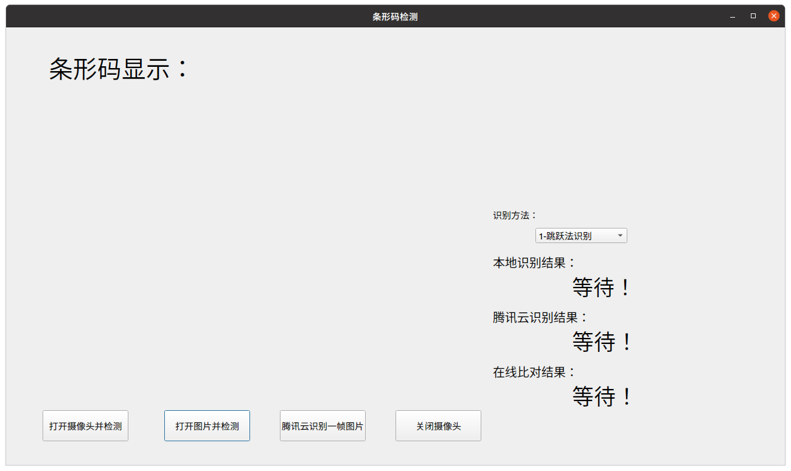
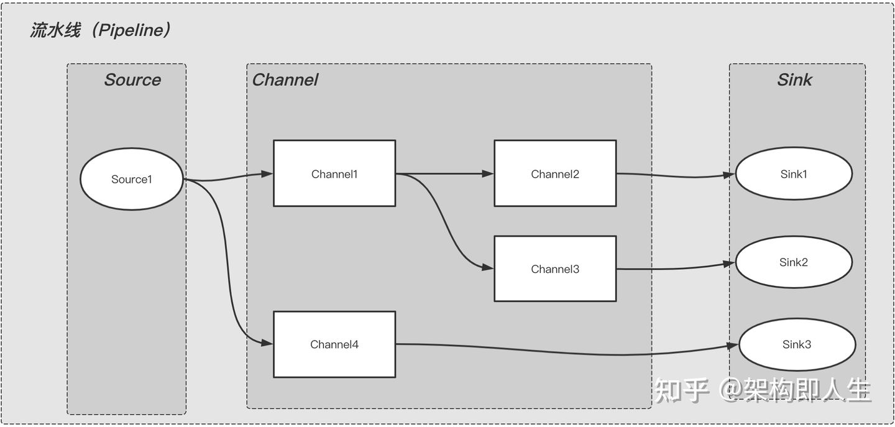

# barCodeDetector  
机器视觉大作业，菜鸟驿站条形码识别实现  
   

# 实现方式  
本项目使用多种实现方式完成条形码提取、检测、解码  
通过QT实现GUI显示  
  

# 环境搭建  
本项目基于OpenCV4.5+和QT5.12+完成基础环境配置  
如果QT是以安装包形式安装，需要在项目根目录CMakeLists.txt中指定QT的CMAKE_PREFIX_PATH  
请替换`/home/hi/Qt5.12.10/5.12.10/gcc_64`为你自己机器的QT安装位置  
```cmake  
set(CMAKE_PREFIX_PATH ${CMAKE_PREFIX_PATH}  
                      ${GITHUB_WORKSPACE}/qtApp/Qt/5.12.10/5.12.10/gcc_64  
                      /home/hi/Qt5.12.10/5.12.10/gcc_64)  
```  
如果OpenCV安装位置没有设置为环境变量，需要自行配置OpenCV的一些路径为环境变量，否则需要修改CMakeLists.txt完成编译  

# 使用方式  
## 按钮一：打开摄像头并检测  
打开摄像头，并一直检测条形码，如果有条形码则按EAN13编码方式解码并在本地识别结果框中显示  
### 多线程计算  
在视频/摄像头打开检测条形码的时候，有些图像处理的操作可能很耗时，以FPS为30为例，如果某一帧处理较慢将可能会掉帧，而且容错率较小，所以设计一个图像缓冲队列将相机的每一帧放到队列中(生产)，然后通过其他线程完成对这帧数据的消费过程。  

#### Pipeline 架构(设计模式)  
Pipeline模式为管道模式，也称为流水线模式。通过预先设定好的一系列的阶段来处理输入的数据，每个阶段的输出即是下一个阶段的输入。  
  
**[作者：架构即人生；来源：知乎；著作权归作者所有](https://zhuanlan.zhihu.com/p/355034910)**  
这张图讲了整个流水线内数据流转是从上游到下游，上游的输出是下游的输入，按阶段依次执行。  
- Source: 表示数据来源，比如一帧图像。  
- Channel：表示对数据进行处理的组件，比如把刚刚的一帧图像裁剪。  
- Sink：表示数据落地或下沉的地方，比如：把裁剪的图像解码为数字(条形码解码)。  

可以看出，Pipeline是由Source(必须有)，Channel(不一定需要)，Sink(必须有)三种类型的组件自由组合而成的。  
#### 生产者消费者 设计思想  
在多线程开发中，如果生产者生产数据的速度很快，而消费者消费数据的速度很慢，那么生产者就必须等待消费者消费完了数据才能够继续生产数据，因为生产那么多也没有地方放啊；同理如果消费者的速度大于生产者那么消费者就会经常处理等待状态，所以为了达到生产者和消费者生产数据和消费数据之间的平衡，那么就需要一个缓冲区用来存储生产者生产的数据，所以就引入了生产者-消费者模式。  
简单来说这里的缓冲区的作用就是为了平衡生产者和消费者的处理能力，起到一个数据缓存的作用，同时也达到了一个解耦的作用。  
通过[A simple C++11 Thread Pool implementation](https://github.com/progschj/ThreadPool)实现的线程池和自己实现OpenCV视频帧队列完成这个设计的实现。  

### 实现  


## 按钮二：打开图片并检测  
打开图片，如果有条形码则按EAN13编码解码并在本地识别结果框中显示，如果此前已经打开摄像头，则会自动关闭  

## 按钮三：腾讯云识别一帧图片  
只是检测前面两个功能的结果是否正确，会调用腾讯云识别并解码刚刚的一帧或者刚才打开的那幅图片，在腾讯云识别结果框中显示  

## 按钮四：关闭摄像头  
如果之前打开摄像头，则关闭摄像头  

# 版权信息  
本项目受MIT License保护。请遵守MIT License。我作为开源爱好者感谢您这种行为！  
This project is protected by the MIT license. Please comply with the MIT license. As an open source enthusiast, I thank you for this kind of behavior!  
本项目的诞生离不开众多开源项目以及其他开源软件。这些开源项目由各自许可证保护，并不完全受本项目许可证保护。  
- 本仓库包含了从 progschj (https://github.com/progschj/ThreadPool) 下载的源码，并遵循其 Zlib 公共许可协议。  
